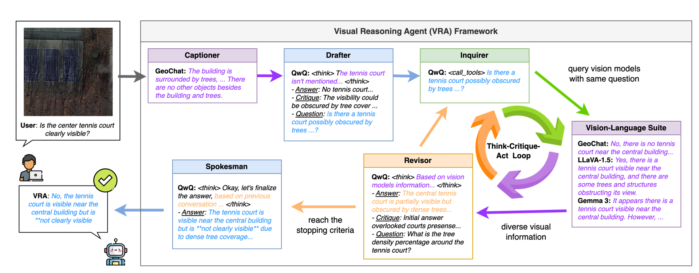

# Visual Reasoning Agent (VRA)
> Participate in the [Berkeley AgentX Competition 2025](https://rdi.berkeley.edu/agentx/#submissions)



Developing trustworthy intelligent vision systems for high-stakes domains, e.g., remote sensing and medical diagnosis, demands broad robustness without costly retraining. We propose Visual Reasoning Agent (VRA), a training-free, agentic reasoning framework that wraps off-theshelf vision-language models and pure vision systems in a Think-Critique-Act loop. While VRA incurs significant additional test-time computation, it achieves up to $40 \%$ absolute accuracy gains on challenging visual reasoning benchmarks. Future work will optimize query routing and early stopping to reduce inference overhead while preserving reliability in vision tasks.

> [!note]
> This code is for local models only, but it is adaptable to commercial APIs.


## Installation
You will git clone this repo in the later section: [VRA setup](#vra-setup).

### Environment

Install miniconda following the [official instructions](https://www.anaconda.com/docs/getting-started/miniconda/install#quickstart-install-instructions).

Create a new environment called `vra` and activate it.

```bash
conda create --name vra python=3.11 -y 
conda activate agent
```

### Inference server: Ollama

Install Ollama.

```bash
curl -fsSL https://ollama.com/install.sh | sh
```

Quick test.

```bash
ollama serve
```

### Agent platform: LangChain, LangGraph

Install LangChain.

```python
pip install langchain
```

Install LangChain-ollama, the LangChain extension for Ollama.

```bash
pip install -U langchain-ollama
```

Install LangGraph and other necessary packages.

```bash
pip install langchain_community langgraph langgraph-checkpoint-sqlite transformers pillow wandb dotenv
```

To launch local LangGraph server, we need to upgrade `langgraph-cli`.

```bash
pip install --upgrade "langgraph-cli[inmem]"
```

### VRA

Clone the repo and navigate to the root folder.

```bash
git clone git clone https://github.com/chungenyu6/Berkeley_AgentX-VRA.git
cd Berkeley_AgentX-VRA
```

Navigate to the folder LangGraph source code folder and install the package.

```bash
cd src && pip install -e .
```

Create a `.env` file by copying the provided file, and edit it based on the needs, e.g., API keys.

```bash
cp .env.example .env
```

### Evaluation dataset: VRSBench VQA subset

Follow the [official repo](https://github.com/lx709/VRSBench) to download the dataset and place it as follows:

```
datasets/
├── VRSBench_vqa-n1000/
│   └── img/ (PLACE IMAGES HERE)
|   └── json/
...
```

## Usage

### Load models on local GPUs

Follow the [official ollama documents](https://github.com/ollama/ollama) to load models on local GPUs.

By default, the following models are assumed to be loaded when executing VRA:
- Agent backbone reasoning model
    - `QWQ` on local API: `http://localhost:11439`
- Vision model
    - `LLaVA-1.5` on local API: `http://localhost:11436`
    - `Gemma3` on local API: `http://localhost:11433`
- Evalation model for VRSBench VQA subset
    - `Phi-4` on local API: `http://localhost:11434`
    
### Execute VRA with one time inference

Note that at this stage, you should have your models ready for inference and within the `vra` conda environment.

Navigate to the `ROOT_FOLDER/src` folder and launch the agent app. Note, it's the first `src` folder under the root folder.


```bash
cd ROOT_FOLDER/src && langgraph dev
```

Open another terminal, and activate the `vra` conda environment, then navigate to the root folder.

```bash
conda activate vra
cd Berkeley_AgentX-VRA
```

Execute the script for one time inference.

```bash
python src/tests/exec_agent.py
```


### Evaluate VRA on VRSBench VQA subset

Make sure you activate the `vra` conda environment, then navigate to the root folder.

```bash
conda activate vra
cd Berkeley_AgentX-VRA
```

Example for evaluating VRA.

```bash
python eval/VRSBench_vqa-n1000/evaluate.py \
--qtype object_quantity \
--sample 1 \
--model agent \
--max_reflexion_iters 1 \
--version vra_v1 \
--wandb False
```

Example for evaluating LVLM alone.

```bash
python eval/VRSBench_vqa-n1000/evaluate.py \
--qtype object_quantity \
--sample 1 \
--model gemma3 \
--wandb False
```

